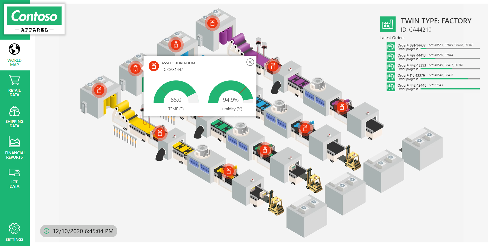
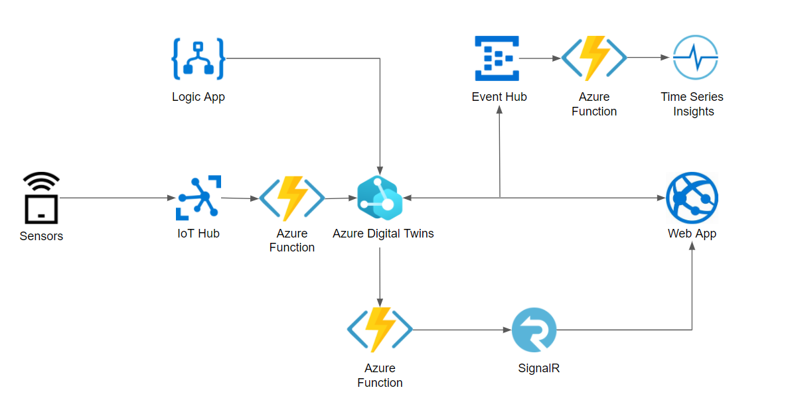
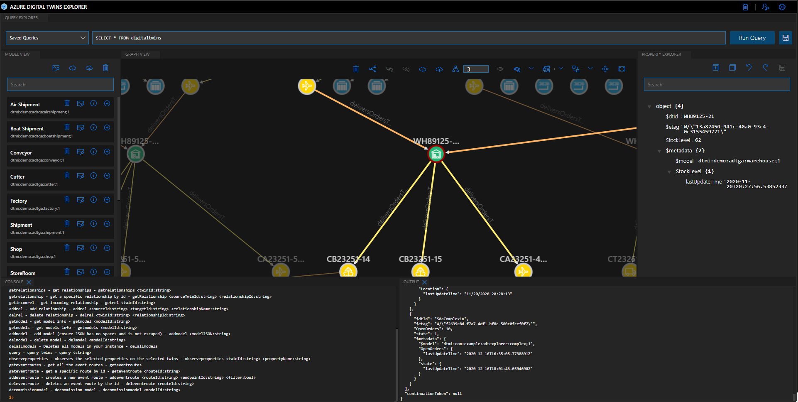

# Azure Digital Twins - Contoso Apparel 

## Overview
Azure Digital Twins is a platform as a service (PaaS) offering that enables the creation of knowledge graphs based on digital models of entire environments. These environments could be buildings, factories, farms, energy networks, railways, stadiums, and more—even entire cities. These digital models can be used to gain insights that drive better products, optimized operations, reduced costs, and breakthrough customer experiences. 

The following demos provide implementation guidance via a standalone demo web app and a developer focused backend sample for users to experiment with.

## Prerequisites
- Azure CLI ([Download](https://docs.microsoft.com/en-us/cli/azure/install-azure-cli)).
- Git ([Download](https://git-scm.com/download)).
- Azure Subscription. You can set up a [trial account](https://azure.microsoft.com/en-us/free/search/) here.
- Visual Studio Code - Required for the developer version ([Download](https://code.visualstudio.com/download))
- .NET Core runtime - Required for the developer version ([Download](https://dotnet.microsoft.com/download))
- Digital Twins Explorer - Required for the developer version ([Download](https://github.com/Azure-Samples/digital-twins-explorer))

## Clone the ADT Demo Repository

Git will be used to copy all the files for the demo to your local computer.  

1. Open a command prompt and navigate to a folder where the repo should be downloaded.
1. Issue the command `git clone https://github.com/Azure-Samples/IoTDemos.git`.
1. The demo assets will now be available on your device. 

## Azure Resource Deployment

An Azure Resource Manager (ARM) template will be used to deploy all the required resources in the solution.  Click on the link below to start the deployment. Note that you may need to register Azure Resource Providers in order for the deployment to complete successfully.  If you get an error that a Resource Provider is not registered, you can register the Resource Provider by following the steps in this [link](https://docs.microsoft.com/en-us/azure/azure-resource-manager/management/resource-providers-and-types).

> **IMPORTANT!** You need to ensure that the region you choose for the Resource Group supports all of the resources required for your deployment. 
We can confirm that **WEST US 2** supports all required resources.

### Contoso Apparel Standalone Web App

This ARM deployment will deploy the standalone Contoso Apparel web application. The web app uses mock data to represent the Azure Digital Twins and Time Series Insights solution in the developer version below. **This solution is for demo purposes only and does not integrate with any other Azure services.** 

Overview and Demonstration (click image for demo video):
[](https://www.youtube.com/watch?v=ScmK-bKJ4MIe)

Follow the steps to deploy the required Azure resources:

1. Deploy ARM template (Ctrl/Command + left click to open in a new tab):

    <a href="https://portal.azure.com/#create/Microsoft.Template/uri/https%3A%2F%2Fgithub.com%2FAzure-Samples%2FIoTDemos%2Fblob%2Fmaster%2FADT-SupplyChainDemo%2Fdeployment%2Fwebsite-template-agad.json" target="_blank">
        
    </a>

1. Configure the following fields:

   - **Subscription**: Select the Subscription.
   - **Resource group**:  Click on **Create new** and provide a unique name for the Resource Group.
   - **Location**: Select the Region where to deploy the resources. Keep in mind that all resources will be deployed to this region, so make sure it supports all of the required services.

        > **NOTE**: The template has been confirmed to work in West US 2 region.
   - **Prefix**: The template will generate a unique ID **once you start your deployment**. Alternatively, you can enter your own prefix.

1. Click **Review + create**.
1. Click **Create** and wait for the deployment to finish.

> **NOTE:** If you are only interested in deploying the standalone version. You do not need to complete any more steps. You can browse to the URL of the newly created Web App in your Resource Group.

**Demo Clickthrough Guide**

The following steps will guide you through the standalone web application to explore capabilities.

1. In the [Azure portal](https://portal.azure.com/) select the **Resource Group** you created.
1. Select the **App Service** resource.
1. **Click** the URL to browse to the deployed web app from the overview pane. 
1. **Click** on the factory in South America and observe twin data.
1. **Click** on the shipment in the Indian Ocean to observe twin data.
1. **Press** space bar to simulate Microsoft Teams message.
1. **Click** the **Signature Tee** filter to see relevant supply lines.
1. **Click** the store in California.
1. **Click** the bottom order number **442-12448**.
1. **Click** the shipment in the Atlantic Ocean and observe historical twin data. 
1. **Click** the factory in Pakistan and observe historical twin data then **View Factory**.
1. **Click** on any sensor in the factory to observe live telemetry. *Note that the green factory line storeroom has high humidity.* 
1. **Click** the bottom order number **442-12448** from **Latest Orders**.
1. **Click** on the storeroom and then **Time Series Insights**.
1. **Click** on **Change Y-Axis Type** to observe the historical high humidity of line 2.
1. **Click** on **VIEW IMPACT** to show the impact assessment of shutting line 2 down.
1. **Click** the store in California to analyze financial impact.
1. **Click** the store in London to analyze financial impact.
1. **Click** the factory in Pakistan and then **STOP LINE**.
1. Observe alternative supply lines fulfilling orders. 

### Contoso Apparel Developer Version

The developer version is a backend implementation of the standalone web application. You will be creating multiple Azure resources to simulate and analyze digital twins using the Digital Twin Explorer tool (see the end of the document for usage). You will also be able to explore historical data via a Time Series Insights environment. **This solution will allow you to get hands on with Azure Digital Twins and other Azure services.** 

> **NOTE!** Architecture and Digital Twin Explorer tool usage are at the end of this document. 

Follow the steps to deploy the required Azure resources:

1. Deploy ARM template (Ctrl/Command + left click to open in a new tab):

    <a href="https://portal.azure.com/#create/Microsoft.Template/uri/https%3A%2F%2Fgithub.com%2FAzure-Samples%2FIoTDemos%2Fblob%2Fmaster%2FADT-SupplyChainDemo%2Fdeployment%2Fdigtwins-template-agad.json" target="_blank">
        
    </a>

1. Configure the following fields:

   - **Subscription**: Select the Subscription.
   - **Resource group**: If you deployed the standalone app above, choose the same Resource Group as that. Otherwise,  click on **Create new** and provide a unique name for the Resource Group.
   - **Location**: Select the Region where to deploy the resources. Keep in mind that all resources will be deployed to this region, so make sure it supports all of the required services.

        > **NOTE**: The template has been confirmed to work in West US 2 region.
   - **Prefix**: The template will generate a unique ID **once you start your deployment**. Alternatively, you can enter your own prefix.
       > **IMPORTANT!** If you deployed the standalone version, you should use the same prefix here to share resources. Note that the generated prefix will be the same as it uses the Resource Group ID as the unique identifier.

1. Click **Review + create**.
1. Click **Create** and wait for the deployment to finish.

To be able to complete all of the steps in this document, you need to have a role in your subscription that has the following permissions:

* Create and manage Azure resources
* Manage user access to Azure resources (including granting and delegating permissions)

Common roles that meet this requirement are Owner, Account admin, or the combination of User Access Administrator and Contributor.

Also, the account that will be used to authenticate the Logic App and for Azure Digital Twins setup will need the **Azure Digital Twins Data Owner** role.

## Configure Azure Digital Twins permission

1. In the [Azure portal](https://portal.azure.com/) select the **Resource Group** you created earlier.
1. Select the **Azure Digital Twins** resource.
1. Click the **Access control (IAM)** option in the left menu.
1. Click the **Add** option in the top bar.
1. Click the **Add role assignment**.
   > **NOTE**: If you can't assign a role, you may not have the necessary privileges.
1. In the **Role** input, search for the `Azure Digital Twins Data Owner` role.
1. In the **Select** input, search for the account that will be used (most likely yourself).
1. Click the **Save** button.

## Logic App Setup

Azure Logic Apps is a cloud service that helps you automate workflows across apps and services. By connecting Logic Apps to the Azure Digital Twins APIs, you can create automated flows to interact with your digital twins.

We will be using a Logic App to simulate shipment ETA information being updated from an ERP system. However, our Logic App runs on a timer that will randomly update the ETA for demonstration purposes. 

>**IMPORTANT!** The interval for the update is 1 hour to due to cost efficiency. You can update this directly in the Logic App if you wish to have more regular intervals.

### App registration client secret generation

At this point the app registration must be created and configure with the right permissions to allow the communication with the DigitalTwins resources and we will only do the setup required by the custom logic app connector.

1. In the [Azure portal](https://portal.azure.com/) select Azure Active Directory from the left blade.
1. Click **App registrations**.
1. Click **+ New registration**.
1. Give the app registration a **Name**.
1. Leave the defaults and click **Register**.
1. Click the **Certificates & secrets** option in the left menu.
1. At the **Client secrets** section click the **New client secret** button.
1. Enter the description for the client secret and the desired expiration option.
1. Click the **Add** button.
1. Verify that the client secret is visible on the **Certificates & secrets** page.
1. Take note of the **Value** to use later in the set up(you can also copy it to the clipboard with the `Copy` icon).
1. Select **Overview** from the left navigation.
1. Copy the **Client ID** and **Tenant ID** for later in the set up.

### Configure connector

Azure Digital Twins does not currently have a certified (pre-built) connector for Logic Apps. Instead, the current process for using Logic Apps with Azure Digital Twins is to create a custom Logic Apps connector.

The connector resource will be created during the ARM template deployment but we will need to do the configuration and authentication manually.

1. In [Azure portal](https://portal.azure.com/) navigate to the Resource Group you created earlier.
1. Select the **Azure Digital Twins** resource.
1. Copy the **Host name** value.
1. Go back to the Resource Group and select the **Logic Apps Custom Connector** resource.
1. Click the **Edit** button from the overview view..
1. In the edit view configure the following:
    * Custom connectors
      * **API Endpoint**: REST (leave default)
      * **Import mode**: OpenAPI file (leave default)
      * **File**: This will be a custom Swagger file. Click **Import**, locate the file `deployment/logic-app/digitaltwins.json` and click **Open**.
    * General information
      * **Icon**: Upload an icon (optional)
      * **Icon background color**: Enter hexadecimal code in the format '#xxxxxx' for your color (optional).
      * **Description:** Enter a description (optional).
      * **Scheme:** HTTPS (leave default)
      * **Host:** The host name of your Azure Digital Twins instance. 
      * **Base URL:** / (leave default)
1. Click on **Update Connector** at the top
1. Click the **Security** button to continue.
1. Configure the following information:
    * Authentication type: OAuth 2.0
    * OAuth 2.0:
      * **Identity provider:** Azure Active Directory
      * **Client ID:** The Application (client) ID for your Azure AD app registration
      * **Client secret:** The Client secret you created for your Azure AD app registration
      * **Login URL:** `https://login.windows.net` (leave default)
      * **Tenant ID:** The Directory (tenant) ID for your Azure AD app registration
      * **Resource URL:** `0b07f429-9f4b-4714-9392-cc5e8e80c8b0`
      * **Scope:** `Directory.AccessAsUser.All`
      * **Redirect URL:** (leave default for now)
1. Note that the Redirect URL field says `Save the custom connector to generate the redirect URL`. Do this now by clicking **Update connector** across the top of the pane to confirm your connector settings.
1. Return to the **Redirect URL** field and copy the value that has been generated. You will use it later in the set up.
  > **NOTE** This is all the information that is required to create your connector (no need to continue to the Definition step). You can close the Edit Logic Apps Custom Connector pane by clicking the **X** in the top corner.

### Grant connector permissions in you App Registration

Next, use the custom connector's Redirect URL value you copied in the last step to grant the connector permissions in your App Registration.

1. In the [Azure portal](https://portal.azure.com/) select Azure Active Directory from the left blade.
1. Click **App registrations** and select the registration you created earlier.
1. Click the `Authentication` option in the menu.
1. Click **+ Add a platform**.
1. Click **Web**.
1. Enter the redirect URL you obtained earlier in the **Redirect URIs** input.
1. Ensure **Access tokens** and **ID tokens** are selected.
1. Click **Configure**.

### Authorize the connector

The connector is now configured but we still need to authorize the connection.

1. In [Azure portal](https://portal.azure.com/) navigate to the Resource Group you created earlier.
1. Select the **Api Connection** resource.
1. Click the **Edit API connection** in the left blade.
1. Click the **Authorize** button and authenticate.
1. Click the **Save** button.

## Twin models and Twins Setup

For the next section we will use the [Digital Twins Explorer](https://github.com/Azure-Samples/digital-twins-explorer).
>**IMPORTANT!** Please ensure you have the latest version from GitHub or some of the following steps may fail.

Follow the instructions in the Digital Twin Explorers README to connect to your ADT instance.

1. Click **Upload Models** from the model viewer panel.
1. Select all the JSON models in the `models` folder.
1. Select **Open** to upload.
1. Click **Import Graph** from the graph viewer panel. 
1. Select the `models/FullTwins.xlsx` file.
1. Click **Open**.
1. Click the **Save** icon in the top right of the graph viewer to import twins.
1. Click **Upload Model Images**  above the search input in the model viewer panel.
1. Select all the files in the `models/icons` folder of the project.
1. Click **Run Query** with the default query to display the twins.

## Updating Digital Twins from the IoT Hub

1. In the [Azure portal](https://portal.azure.com/) select the **Resource Group** you created earlier.
1. Select the **IoT Hub** resource.
1. Click the **Events** option in the left menu.
1. Click the **+ Event Subscription** button in the top bar.
1. Enter the following information in the input fields:
    * **Name:**: `IoTHubToTwinsEvent`
    * **Event Schema**: `Event Grid Schema`
    * **System Topic Name:** `IoTHubToTwinsTopic`
    * **Filter to Event Types:** Make sure to uncheck previous selected options and only check the `Device Telemetry` option.
    * **Endpoint Type:** Select the `Azure Function` option from the list.
1. Click the **Select an Endpoint** link, this will open a new panel for the selection of the azure function.
1. In the **Select Azure Function** select the published function : `{prefix}DTFunctions`.
1. For the **Function** select the `IotHubToTwins` function.
1. Click the **Confirm Selection** button.
1. Click the **Create** button and wait for the process to finish.

Now we need to create the required permissions to allow the Digital Twin updates by the Azure Function:

1. Open a terminal with the Azure CLI available and make sure that you're logged into your account with the command: `az login`. Ensure you have selected the correct subscription.
1. Use the following command to create the system-managed identity. **Take note of the principalId field in the output**.
    ```
    az functionapp identity assign -g {RESOURCE_GROUP_NAME}  -n {FUNCTION_APP_NAME}
    ```
1. Use the **principalId** value from the output in the following command, to assign the function app's identity to the Azure Digital Twins Data Owner role for your Azure Digital Twins instance:
    ```
    az dt role-assignment create --dt-name {DIGITAL_TWINS_INSTANCE_NAME} --assignee "{principalId}" --role "Azure Digital Twins Data Owner"
    ```

## Integrate Azure Digital Twins with Time Series Insights

Most of the required resources and configuration is done during the ARM  deployment, but some extra steps are required to finish the configuration.

### Create route for the Event Hub namespace

1. Open a terminal with the Azure CLI available and make sure that you're logged into your account with the command: `az login`. Ensure you have selected the correct subscription.
1. Create a route in Azure Digital Twins to send twin update events to your endpoint. The filter in this route will only allow twin **update** messages to be passed to the endpoint.
    ```
    az dt route create -n {DIGITAL_TWINS_INSTANCE_NAME} --endpoint-name EventHubEndpoint --route-name EventHubRoute --filter "type = 'Microsoft.DigitalTwins.Twin.Update'"
    ```
   
## Real-time telemetry updates

Follow the next steps to configure our deployed resources to send telemetry updates using SignalR.

First we will create a new route:
 > **NOTE:** The Event Grid Topic and the Digital Twins endpoint were created as part of the ARM deployment earlier in the set up.

1. Open a terminal with the Azure CLI available and make sure that you're logged into your account with the command: `az login`. Ensure you have selected the correct subscription.
1. Create an Azure Digital Twins route that sends events to the Azure Digital Twins endpoint you created.
    ```
    az dt route create --dt-name {DIGITAL_TWINS_INSTANCE_NAME} --endpoint-name DTEndpoint --route-name DTRoute
    ```

Now we need to configure the subscription that will use our created resources.

1. In the [Azure portal](https://portal.azure.com/) select the **Resource Group** you created earlier.
1. Click the **Event Grid Topic** resource.
1. Click the **+ Event Subscription** button on the top.
1. Enter the **Name**, `DTToSignalR`.
1. For the **Endpoint type** select **Azure Function**.
1. Click the **Select an endpoint** option.
1. In the **Select Azure Function** panel find function app named `{prefix}DTFunctions`.
1. For the **Function** select the `broadcast` option from the list.
1. Click the **Confirm selection** button.
1. Click the **Create** button.

Using the Digital Twins Explorer tool, you can update the .env file to your functions app to receive broadcasts from SignalR. For more information follow the [documentation](https://github.com/Azure-Samples/digital-twins-explorer#advanced).


## Device Simulation

In this section we will simulate digital twin property updates to be observed in the Digital Twins Explorer tool.

1. Open **Visual Studio Code.**
1. Open the folder `tools/devices-simulation`.
1. Open the `tools/devices-simulation/appSettings.json` file.
1. Enter the following values:
    * **IoTHubConnectionString**: Connection string value, to obtain this you can follow these steps..
        1. Click the `Shared access policies` from the options in the left menu.
        1. Click the `iothubowner` policy from the list.
        1. Copy the `Connection String--primary key` value.
    * **MinutesToRun**: Number of minutes as an integer to run the simulation (simulation can be stopped at any moment by pressing the **Escape** key). Suggested time is at least **10 minutes.**
1. Save the file.
1. Open a terminal and run the following command: `dotnet run`.
    > **NOTE:** If you didn't enter all the values in the `appSettings.json` file. The application will prompt you for them.
1. Enter the command `start` and press **enter**.

> **IMPORTANT!** Telemetry will appear in the Property Explorer panel of the Digital Twins Explorer tool. It will show up once it has an update for the selected node at the bottom of the object tree (it will not be visible until a message is received). Updates may have a small delay. One suggestion is to select a node and wait for the update as telemetry state is not retained after being rendered. 

## Time Series Insights
Once you have ran the simulator above you will be able to analyze your data in Time Series Insights.

1. In the [Azure portal](https://portal.azure.com/) select the **Resource Group** you created earlier.
1. Select the **Time Series Insights** resource.
1. Click **Data Access Policies**.
1. If your account is not present, complete the following:
    - Click **+ Add**.
    - Click **Select User** and search for you account.
    - Click **Select**.
    - Click **Select role**.
    - Select both **Reader** and **Contributor**.
    - Click **Ok**.
    - Click **OK** to save.
1. Click **Overview** on the left blade.
1. Click **Go to TSI Explorer**.

## Solution Architecture

Below is the high-level Architecture of the components in the supply chain demo.



**Azure IoT Hub**

After you have run the simulator to generate data for you IoT devices, you can see these in Azure using the following steps:
1. In [Azure portal](https://portal.azure.com/) navigate to the Resource Group you created earlier.
1. **Select** the **IoT Hub** resource.
1. **Select** the **IoT Devices** option from the left hand blade to see your devices. 

**Azure Functions**

The first function receives updates from IoT devices via event grid and then updates either telemetry or properties on the twin. You can see the full code in `IotHubToTwin.cs`. Here is a snippet of the update:

```c#
    private async Task UpdateDigitalTwinProperty(DigitalTwinsClient client, string deviceId, JToken body, string propertyName)
    {
      var propertyToken = body[propertyName];
      if (propertyToken != null)
      {
        if (Constants.Telemetries.Contains(propertyName.ToUpper()))
        {
          var data = new Dictionary<string, double>();
          data.Add(propertyName, propertyToken.Value<double>());
          await client.PublishTelemetryAsync(deviceId, JsonConvert.SerializeObject(data));
        }
        else
        {
          // Update twin using device property
          var uou = new UpdateOperationsUtility();
          uou.AppendReplaceOp($"/{propertyName}", propertyToken.Value<double>());
          await client.UpdateDigitalTwinAsync(deviceId, uou.Serialize());
        }
      }
    }
  }
```

The second function uses the SignalR service to broadcast the stream as telemetry does not have backing storage, therefore, we need a mechanism to display these in our web application. You can see the full code in `SignalRFunctions.cs`. Here is a snippet of the broadcast: 

```c#
[FunctionName("broadcast")]
    public static Task SendMessage(
        [EventGridTrigger] EventGridEvent eventGridEvent,
        [SignalR(HubName = "dttelemetry")] IAsyncCollector<SignalRMessage> signalRMessages,
        ILogger log)
    {
      if (eventGridEvent == null || !EventMappings.TryGetValue(eventGridEvent.EventType.ToLowerInvariant(), out var target))
      {
        log.LogInformation($"Unrecognized event type: {eventGridEvent?.EventType}, skipping");
        return Task.CompletedTask;
      }

      var dtName = eventGridEvent.Topic.Split("/", StringSplitOptions.RemoveEmptyEntries).Last();
      var dtId = eventGridEvent.Subject;
      var evt = JsonConvert.DeserializeObject<JObject>(eventGridEvent.Data.ToString());
      var data = evt["data"];

      log.LogInformation($"Received event from {dtName} for {dtId} with content {data.ToString()}");

      return signalRMessages.AddAsync(new SignalRMessage
      {
        Target = target,
        Arguments = new[] { new { dtId, data } }
      });
    }
```

The third function pushes data from the Event Hub to Time Series Insight. You can see the full code in `ProcessDTUpdateToTSI.cs`. Here is a snippet of the update: 

```c#
    [FunctionName("ProcessDTUpdateToTSI")]
    public static async Task Run(
        [EventHubTrigger("twins-event-hub", Connection = "EventHubAppSetting-Twins")]EventData myEventHubMessage,
        [EventHub("tsi-event-hub", Connection = "EventHubAppSetting-TSI")]IAsyncCollector<string> outputEvents,
        ILogger log)
    {
      JObject message = (JObject)JsonConvert.DeserializeObject(Encoding.UTF8.GetString(myEventHubMessage.Body));
      log.LogInformation("Reading event:" + message.ToString());

      // Read values that are replaced or added
      Dictionary<string, object> tsiUpdate = new Dictionary<string, object>();
      foreach (var operation in message["patch"])
      {
        if (operation["op"].ToString() == "replace" || operation["op"].ToString() == "add")
        {
          string path = operation["path"].ToString().Substring(1);
          path = path.Replace("/", ".");
          tsiUpdate.Add(path, operation["value"]);
        }
      }
      //Send an update if updates exist
      if (tsiUpdate.Count > 0)
      {
        tsiUpdate.Add("$dtId", myEventHubMessage.Properties["cloudEvents:subject"]);
        tsiUpdate.Add("timestamp", DateTime.Now);
        await outputEvents.AddAsync(JsonConvert.SerializeObject(tsiUpdate));
      }
    }
  }
```

**Logic App**

The logic app in this solution is used to simulate the ETA of a shipment that may be typical from an ERP system. You can see how this works by doing the following:

1. In [Azure portal](https://portal.azure.com/) navigate to the Resource Group you created earlier.
1. **Select** the **Logic App** resource.
1. **Select** the **Logic app designer** option from the left hand blade to see the flow.


## Digital Twins Explorer usage

The Digital Twins Explorer tool is used to create, analyze and update your digital twins as well as providing a range of additional features to explore your knowledge graph. The tool is in active development and is updated with new features on a regular basis. More details on the Digital Twins Explorer tool is available in the [GitHub repo](https://github.com/Azure-Samples/digital-twins-explorer).



Below is an overview of the different windows within the tool.

**Query Explorer**- Allows you to use the custom SQL-like Azure Digital Twins query language to query your twin graph. You can also save common queries for future use. For more information see [About the query language for Azure Digital Twins](https://docs.microsoft.com/en-us/azure/digital-twins/concepts-query-language) and [Query the Azure Digital Twins twin graph](https://docs.microsoft.com/en-us/azure/digital-twins/how-to-query-graph).

Usage Examples:

>**IMPORTANT!** Ensure you have Eager Loading turned off in settings if you just want the query results. Eager loading will also bring the child nodes.
 
* Run the query `SELECT * FROM DIGITALTWINS` to view all supply chain artifacts.
* Run the query `SELECT * FROM DIGITALTWINS WHERE IS_OF_MODEL('dtmi:demo:adtga:warehouse;1')` to see all twins of type Warehouse. 
* Run the query `SELECT * FROM DIGITALTWINS WHERE IS_DEFINED(Location)` to get all twins that have the Location prpoerty. 


**Model View** - The model viewer allows you to upload and view custom models defined in the Digital Twin Definition Language that is based on JSON-LD. You can then create twins from your upload model schema. More info:
    * [Elements of a model](https://docs.microsoft.com/en-us/azure/digital-twins/concepts-models#elements-of-a-model).
    * [Properties vs Telemetry](https://docs.microsoft.com/en-us/azure/digital-twins/concepts-models#properties-vs-telemetry)
    * [Possible Schemas](https://docs.microsoft.com/en-us/azure/digital-twins/concepts-models#possible-schemas)
    * [Model model-inheritance](https://docs.microsoft.com/en-us/azure/digital-twins/concepts-models#model-inheritance)

Usage Examples:
* Check your model list, you should see 11 models.
* **Click** on the "Information" icon next to Factory in the model list and observe how it has relationships to multiple sensors within the factory and also to external shipments. You can also see it has multiple properties.
* **Click** on the "Information" icon next to Cutter in the model list and see that is has "Speed" as type Telemetry. See link above to understand the difference between Properties and Telemetry.
* **Click** on the "+" icon next to Conveyor and create a twin called `TestConveyor`. You will see it get added to the graph. We will need this in the next section.

**Graph View** - Allows users to visually update or view relationships as well as analyze their graph. Clicking on a node shows incoming and outgoing relationships and you can also delete existing twins. Any selected twin will populate the property explorer with relevant data.

Usage Examples:
* **Click** on the factory called "FA4421" or any other factory. 
* Hold the ctrl or shift key on your keyboard and then click on the `TestConveyor` twin. Both nodes should be highlighted. 
* **Click**  **Add Relationship** from the top navigation.
* **Click** **Save** to create the relationship.
* You will now notice that "TestConveyor" is a now child of "FA4421".
* You can also **click** on a node and click **Get Relationships** from the navigation bar to see incoming and outgoing relationships.

**Property Explorer** - When a twin is selected, you will see current property values and also telemetry updates if you are running the simulator. You also can update the property values by performing a patch operation.

Usage Example:
* **Click** on a twin of type shop like "RT4465881".
* In the property explorer, changes the StockLevel value to 100.
* **Click** the **Save** icon in the navigation bar.
* Observe the value has been patched with the replace operation.

**Console (enable via settings cog)** - CLI to run multiple commands. Issue the command `help` for a list of operations. 

**Output (enable via settings cog)** - Shows output from API responses and any other relevant operations. 

**Full documentation is available at [Azure Digital Twins Documentation](https://docs.microsoft.com/en-us/azure/digital-twins/).**


 
