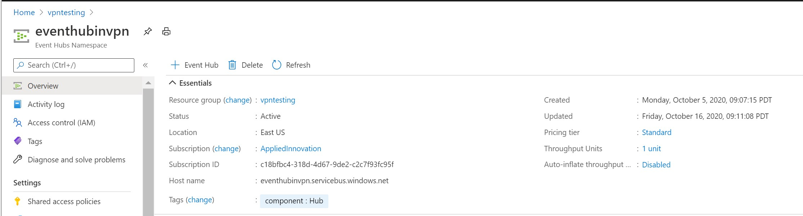
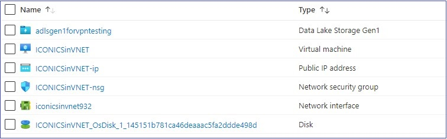
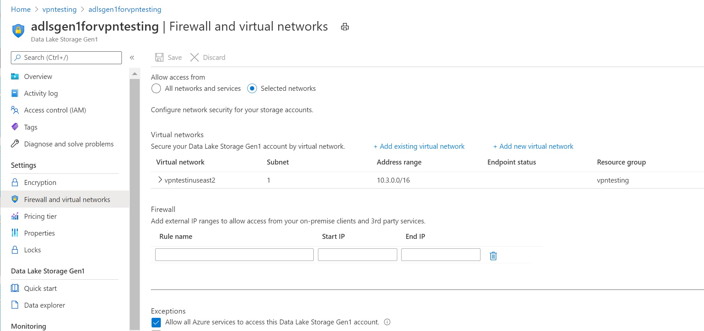

# Creating an End-to-End IoT infrastructure in a Private Network
The default configuration of Azure services allows public IP access to those services. For example an on-premises device with Internet access can connect to an Azure IoT Hub using a URL that resolves to a public IP address. For some scenarios or corporations this might be inappropriate, so we need to turn off public IP access to the relevant Azure services and configure all the services and communications to be on a private network. Though the process for how to do this is documented on a service-by-service basis for the various Azure services, how to connect them together is not entirely obvious.

 The goal of this document is provide a sample of securing all the services and connections in a simple IoT scenario. 

 Note: *This document does not include mouse-click-by-mouse-click instructions on how to deploy the various services. Rather it assumes a basic knowledge of Azure, and includes only what components need to be configured, and examples of the configuration.*
 
 ## Contributors
 - Spyros Sakellariadis, Program Manager, Industry Innovation, Enterprise Commercial Business
 - David Apolinar, Cloud Solution Architect, US Financial Services Industry
 - John Lian, Program Manager, Azure IoT Platform

## Major elements shown in end-to-end solution
This sample does not include all possible services or configurations, of course, only a few in order to demonstrate the basic structures. The components that will be described include:

1. **VPN** - IPsec tunnel between on-premises systems and Azure
2. **Azure IoT Hub** - securing against public IP access
3. **Azure VM** and **Azure Data Lake** - configuring typical Azure assets with only private IP access
4. **DNS** - name resolution for assets with no public IP access

Finally we will provide an example of sending IoT telemetry from on-premises devices through to Azure Data Lake.

## High level architecture
The IoT sample described consists of some on-premises components as well as Azure. To provde a visual reference for the items discussed, here are the high level architectures.

### On-premises configuration
The following diagram shows the elements in the local environment.

### Azure configuration
The following diagram shows the elements in the sample Azure environment. 

## Setting up the site-to-site VPN
The following diagram shows the elements in the sample Azure environment needed to create an IPsec site-to-site Virtual Private Network. 

A 'How-to Guide' for creating a site-to-site VPN is published on the Microsoft website here: [Create a Site-to-Site connection in the Azure portal](https://docs.microsoft.com/en-us/azure/vpn-gateway/vpn-gateway-howto-site-to-site-resource-manager-portal)

Configuration of these elements in the end-to-end sample is shown below. 

### Virtual network
From the Azure portal, select Add > Virtual network. Configuration in the end-to-end sample is as follows:

### Virtual network gateway
From the Azure portal, select Add > Virtual network gateway. The IP address of the Azure virtual network gateway needs to be the public IP of that object, assigned by the system as the gateway is being created. (Here shown as 40.x.x.x) Configuration in the end-to-end sample is as follows:

### Local network gateway
From the Azure portal, select Add > Local network gateway. This object represents the device on-premises that is the local endpoint for the IPsec tunnel. The IP address of the Local network gateway needs to be the public IP of that device, for example, the public IP address of the firewall or router on the WAN port. (Here shown as 24.x.x.x)The Address space needs to be the address space of the local network behind that firewall or router. Configuration in the end-to-end sample is as follows:

### Connection
From the Azure portal, select Add > Connection. The purpose is to create an object that is the connection between the Virtual network gateway and the local network gateway. Pick the local and Azure network gateways created above during setup of the connection. The IP addresses will be added automatically. Configuration in the end-to-end sample is as follows:

 

## Deploying IoT Hub with only private IP access
The following diagram shows the elements in the sample Azure environment. 

A 'How-to Guide' for configuring IoT Hub in a vnet is published on the Microsoft website here: [IoT Hub support for virtual networks with Private Link and Managed Identity](https://docs.microsoft.com/en-us/azure/iot-hub/virtual-network-support)

Configuration of these elements in the end-to-end sample  is shown below. From the Azure portal, select Create a Resource > IoT Hub. Configuration of the IoT Hub in the end-to-end sample is as follows:

### Overview

### Public endpoints
The goal is to disable public IP access to the IoT Hub, which is done in in the Networking section:

### Private endpoints
Select Private endpoint connections and click + to add a private endpoint in the vnet created earlier:

### Private endpoint

This is the private endpoint of the IoT Hub

Note you cannot enumerate IoT Devices or use Device Explorer to see telemetry incoming to IoT Hub because public IP addresses are blocked.

[John - please elaborate/rephrase this section] In order to secure all access to the IoT Hub, it is best to route all messages from the IoT Hub to an independent Event Hub. First, create an Event Hub. From the Azure portal, select Create a Resource > Event Hub. Configuration of the Event Hub in the end-to-end sample is as follows: 

### Event Hub

### Event Hub Networking

### Event Hub Privte Endpoints

### Event Hub Access Control

### Message routing
Having created an Event Hub with only private endpoints, now forward all telemetry coming in to the IoT Hub to that Event Hubusing the IoT Hub Message Routing Feature:

### Message routing detail
Routing details are as follows:

## Deploying downstream Azure assets
The following diagram shows the elements in the sample Azure environment. 

- [Find](https://iconics.com/Documents/WhitePapers/Using-IoTWorX-as-a-Gateway)
- [Find](https://iconics.com/Documents/WhitePapers/Using-IoTWorX-as-a-Gateway)

 

## Deploying DNS servers
DNS servers are needed to resolve URLs for services in Azure. When those services are initially deployed, they are accessed using a URL that resolves to their public IP address. For example

mydemovm.eastus.cloudapp.azure.com may resolve to 52.168.x.x

However, since we are preventing access to any public IP address and using only private endpoints, applications would have to resolve to the private IP address. For example

mydemovm.eastus.cloudapp.azure.com may need to resolve to 10.2.0.x

To do this, a DNS conditional forwarder is needed locally, to resolve requests from on-premises devices to Azure services, and in Azure, to resolve requests from one Azure service to another. 

### Azure
The following diagram shows the elements in the sample Azure environment. 

- [Find](https://iconics.com/Documents/WhitePapers/Using-IoTWorX-as-a-Gateway)

### Local

 

## Sending IoT telemetry to Azure
assume that a 3rd party is installed on a local computer and configured to pull telemetry from devices and forward them to Azure IoT Hub. More on that later...

Detailed guidance on how to set up such a gateway, IoTWorX from ICONICS, is available from the following two locations, and there is no need to replicate it here:

- [Using IoTWorX as a Gateway](https://iconics.com/Documents/WhitePapers/Using-IoTWorX-as-a-Gateway), and 
- [Installing IoTWorX on IoT Edge](https://iconics.com/Documents/Whitepapers/Installing-IoTWorX-on-IoT-Edge)

Since the goal is to have all communications go through a private network, a firewall-to-Azure IPsec tunnel is used. The setup in this sample used a Barracuda F18 CloudGen firewall, though any device capable of setting up an IPsec tunnel would work. Detailed guidance on how to set up an IPsec tunnel from this model Barracuda is available here:

- [Creating a Site-to-Site VPN from a Barracuda firewall to Azure](https://github.com/spyrossak/Azure-vpn-config-samples/blob/master/Barracuda/barracuda.md)

[How to Configure an IKEv2 IPsec Site-to-Site VPN to a Routed-Based Microsoft Azure VPN Gateway](https://campus.barracuda.com/product/cloudgenfirewall/doc/73719171/how-to-configure-an-ikev2-ipsec-site-to-site-vpn-to-a-routed-based-microsoft-azure-vpn-gateway/)

The final piece needed in the local configuration is a DNS conditional forwarder. The IoTWorX gateway is configured to send data to a friendly URL for the Azure IoT Hub, but since the Azure IoT Hub will be configured to have only a private IP address, we need a local DNS server to resolve the Hub URL to the private IP address.

