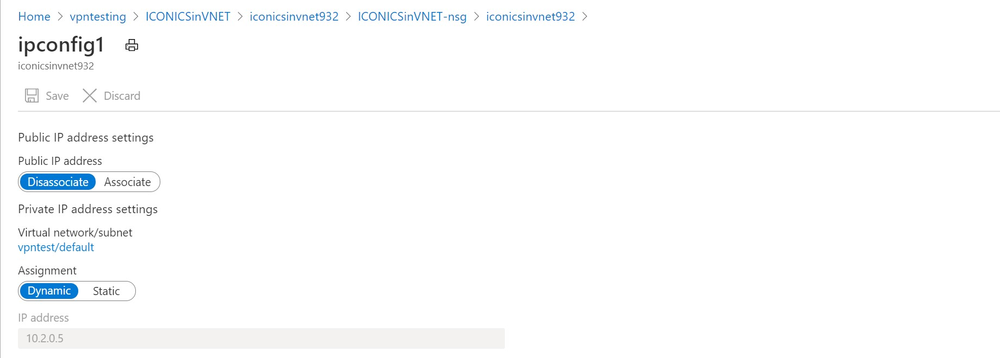

# <span style="color:#0080FF">Creating an End-to-End IoT infrastructure in a Private Network</span>
The default configuration of Azure services allows public IP access to those services. For example an on-premises device with Internet access can connect to an Azure IoT Hub using a URL that resolves to a public IP address. For some scenarios or corporations this might be inappropriate, so we need to turn off public IP access to the relevant Azure services and configure all the services and communications to be on a private network. Though the process for how to do this is documented on a service-by-service basis for the various Azure services, how to connect them together is not entirely obvious.

 The goal of this document is provide a sample of securing all the services and connections in a simple IoT scenario. 

 Note: *This document does not include mouse-click-by-mouse-click instructions on how to deploy the various services. Rather it assumes a basic knowledge of Azure, and includes only what components need to be configured, and examples of the configuration.*

```
TO DO:
- Check: hide Azure subscription name and ID, and change/obfuscate all public IP addresses in the images included below
- Explain the reason we use IoT Routing to an Event Hub. Need John input
- Explain Managed Identities use? Need John input
- Rewrite the DNS section. Need David input
- Edit text between images to improve flow
```

 ## <span style="color:#0080FF">Contributors</span>
 - Spyros Sakellariadis, Program Manager, Industry Innovation, Enterprise Commercial Business
 - David Apolinar, Cloud Solution Architect, US Financial Services Industry
 - John Lian, Program Manager, Azure IoT Platform

## <span style="color:#0080FF">Major elements shown in end-to-end solution</span>
This sample does not include all possible services or configurations, of course, only a few in order to demonstrate the basic structures. The components that will be described include:

1. **VPN** - IPsec tunnel between on-premises systems and Azure
2. **Azure IoT Hub** and **Event Hub** - securing against public IP access
3. **Azure VM** - configuring a typical Azure asset with only private IP access
4. **DNS** - name resolution for assets with no public IP access

## <span style="color:#0080FF">High level architecture</span>
The IoT sample described consists of some on-premises components as well as Azure. To provde a visual reference for the items discussed, here are the high level architectures.

### <span style="color:#0080FF">On-premises configuration</span><a name="OnPremDiagram"></a>
The following diagram shows the elements in the sample's local environment.

<p>

As shown in the diagram above, a 3rd party gateway is installed on a computer which serves to pull telemetry from IoT devices and forwards the data to Azure IoT Hub. Guidance on how to set up such a gateway, IoTWorX from ICONICS, is available in the following locations, and there is no need to replicate it here:

- [Using IoTWorX as a Gateway](https://iconics.com/Documents/WhitePapers/Using-IoTWorX-as-a-Gateway), and 
- [Installing IoTWorX on IoT Edge](https://iconics.com/Documents/Whitepapers/Installing-IoTWorX-on-IoT-Edge)

The output from the gateway should be in a standard JSON format. In the sample shown, data from the gateway looks like this:

```
{"gwy": "iotworx","name": "Output_Voltage","value": 0,"timestamp": "2020-10-20T13:48:55.247Z","status": true}
{"gwy": "iotworx","name": "DC_Bus_Voltage","value": 320.5,"timestamp": "2020-10-20T13:48:55.247Z","status": true}
{"gwy": "iotworx","name": "Capacitance_Temperature","value": 47.1,"timestamp": "2020-10-20T13:48:55.247Z","status": true}
{"gwy": "iotworx","name": "Drive_Run_or_Halt","value": 2,"timestamp": "2020-10-20T13:48:55.248Z","status": true}
```

In addition, a hardware firewall is installed in the local environment, which serves as the local endpoint of the site-to-site VPN to Azure. Configuration of 
the firewall depends upon the make and model of the firewall, of which there are many. Some sample configurations can be found here:

- [Azure VPN Gateways VPN device configuration samples](https://github.com/Azure/Azure-vpn-config-samples)
- [Creating a Site-to-Site VPN from a Barracuda firewall to Azure](https://github.com/spyrossak/Azure-vpn-config-samples/blob/master/Barracuda/barracuda.md)

Finally, there is a DNS server in the local environment. Configuration of this server is described later in this document.

### <span style="color:#0080FF">Azure configuration</span><a name="AzureDiagram"></a>
The following diagram shows the elements in the sample's Azure environment. 

<p>

Each of these elements is described in the following sections.

## <span style="color:#0080FF">Setting up the site-to-site VPN</span>
The following diagram shows the elements in the sample Azure environment needed to create an IPsec site-to-site Virtual Private Network. 

<p>


A 'How-to Guide' for creating a site-to-site VPN is published on the Microsoft website here: [Create a Site-to-Site connection in the Azure portal](https://docs.microsoft.com/en-us/azure/vpn-gateway/vpn-gateway-howto-site-to-site-resource-manager-portal)

Configuration of these elements in the end-to-end sample is shown below. 


### <span style="color:#0080FF">Virtual network</span>
From the Azure portal, start the process of creating a virtual network by selecting **Create a Resource** > **Virtual network**. During setup, accept the proposed private IP address range, for example 10.2.0.0/16. When deployment is complete, select the resource. The result should look similar to the following, with the exception of the DNS server, which will be added later:

<p>
### <span style="color:#0080FF">Virtual network gateway</span>
From the Azure portal, select **Create a Resource** > **Virtual network gateway**. Select the Virtual Network created earlier, and accept the proposed public IP address. The result should look similar to this:

<p>


### <span style="color:#0080FF">Local network gateway</span>
From the Azure portal, select **Create a Resource** > **Local network gateway**. This object represents the device on-premises that is the local endpoint for the IPsec tunnel. The IP address of the Local network gateway needs to be the public IP of that device, for example, the public IP address of the firewall or router on the WAN port provided by the ISP providing connectivity to the local site. (Here shown as 24.x.x.x). The Address space needs to be the address space of the local network behind that firewall or router. Configuration in the end-to-end sample is as follows:


<p>

### <span style="color:#0080FF">Connection</span>
From the Azure portal, select **Create a Resource** > **Connection**. The purpose is to create an object that represents the connection between the Virtual Network Gateway and the Local Network Gateway. Pick the local and Azure network gateways created above during setup of the connection. The IP addresses will be added automatically. Configuration in the end-to-end sample is as follows: 

<p>

### <span style="color:#0080FF">Peering</span>
Finally, in the end-to-end sample we created a second vnet in another Azure region, in order to emulate more complex environments where all of the assets are not in the same region. Having done this, all we need to do is create a vnet peering. From the vnet resource page, configure the peering between the two vnets in the Peerings section:

<p>

## <span style="color:#0080FF">Deploying an IoT Hub with only private IP access</span>
The following diagram shows the elements in the end-to-end sample Azure environment. 

<p>
A 'How-to Guide' for configuring IoT Hub in a vnet is published on the Microsoft website here: [IoT Hub support for virtual networks with Private Link and Managed Identity](https://docs.microsoft.com/en-us/azure/iot-hub/virtual-network-support)

Configuration of these elements in the end-to-end sample  is shown below. From the Azure portal, select **Create a Resource** > **IoT Hub**. When deployment is complete, select the resource. The Overview should be similar to the following:

### <span style="color:#0080FF">Overview</span>
<p>
### <span style="color:#0080FF">Public access</span>
The goal is to disable public IP access to the IoT Hub, which is done in in the Networking section. Disable Public Access:

<p>

### <span style="color:#0080FF">Private endpoints</span>
Next, create private IP endpoints for this hub. Select the Private endpoint connections tab:

<p>


Select **+ Private endpoint** to create the private endpoint. The result should look similar to this:

<p>

Note you cannot enumerate IoT Devices or use Device Explorer to see telemetry incoming to IoT Hub because public IP addresses are blocked.

```
TO DO:
John - please elaborate/rephrase this section
```
In order to secure all access to the IoT Hub, it is best to route all messages from the IoT Hub to an independent Event Hub. 

## <span style="color:#0080FF">Event Hub</span><a name="EventHub"></a>
First, create an Event Hub. From the Azure portal, select **Create a Resource** > **Event Hub**. When deployment is complete, configuration should be similar to this: 

### <span style="color:#0080FF">Overview</span>
<p>

### <span style="color:#0080FF">Event Hub Networking</span>

<p>

### <span style="color:#0080FF">Event Hub Private Endpoints</span>

<p>

### <span style="color:#0080FF">Event Hub Access Control</span>

<p>

### <span style="color:#0080FF">Event Hub Access Control</span>

```
TO DO:
Needs explanation
```

<p>


### <span style="color:#0080FF">Message routing</span>
Having created an Event Hub with only private endpoints, now forward all telemetry coming in to the IoT Hub to that Event Hub, using the IoT Hub Message Routing Feature:

<p>

### <span style="color:#0080FF">Message routing detail</span>
Routing details in the sample are set so as to forward everything to the Event Hub, with a consequence that no data can be retrieved from the IoT Hub itself by any application. To do this, set the routing details as follows:

<p>

## <span style="color:#0080FF">Azure virtual machine</span><a name="AzureVM"></a>

Guidance for creating an Azure virtual machine is published on the Microsoft website here: [Quickstart: Create a Windows virtual machine in the Azure portal](https://docs.microsoft.com/en-us/azure/virtual-machines/windows/quick-create-portal).

Configuration of the virtual machine in the end-to-end sample is shown below. From the Azure portal, select **Create a Resource** > **Windows Server 2019 Datacenter**. During setup enter selections so that it is deployed in the virtual network with only private IP access. When deployment is complete, the configuration should be similar to the following:


<p>
<p>
<p>
<p>

To verify that data arriving at the Event Hub is visible within the virtual machine, you can use Visual Studio code with the Event Hub explorer tool installed. After launching Visual Studio code and selecting the Event Hub above, right click and select Start Monitoring. You should see the data that was sent by the on-premises gateway to the Azure IoT Hub and forwarded on to the Event Hub:

<p>

This should be the same as the data coming out of the local gateway, shown in the Local Gateway Configuration section above.

## <span style="color:#0080FF">Deploying DNS servers</span>
```
TO DO:
Needs editing. David - also, can you explain the use of the Private DNS zone records created in the portal?
```

DNS servers are needed to resolve URLs for services in Azure. When those services are initially deployed, they are accessed using a URL that resolves to their public IP address. For example, [http://mydemovm.eastus.cloudapp.azure.com](http://mydemovm.eastus.cloudapp.azure.com) may resolve to `42.x.x.x`. However, since we are preventing access to any public IP address and using only private endpoints, applications would have to resolve to the private IP address. For example, it should resolve to `10.2.0.x` instead of `42.x.x.x`.

To do this, two DNS conditional forwarders are created. Locally, to resolve requests from on-premises devices to Azure services, and in Azure, to resolve requests from one Azure service to another. 


### <span style="color:#0080FF">Azure</span>
A second virtual machine, `DNSforVNST`, is the deployed in the virtual network and configured to have only private IP access:

<p>

In the sample, the DNS server got an IP address of `10.2.0.6`. In that virtual machine, the DNS Service is turned on and conditional forwarding records created for the Azure private domains used by the sample's assets. These conditional forwarders pass resolution requests to the standard Azure DNS service at `168.63.129.16`:

<p>

Next, the network configuration of the Azure VM created [above](#AzureVM), and shown in the [Azure configuration diagram](#AzureDiagram), is edited to use the new Azure DNS server at `10.2.0.6`:

```
   IPv4 Address. . . . . . . . . . . : 10.2.0.5(Preferred)
   Subnet Mask . . . . . . . . . . . : 255.255.255.0
   Default Gateway . . . . . . . . . : 10.2.0.1
   DNS Servers . . . . . . . . . . . : 10.2.0.6
```

When we used Visual Studio Code in the application virtual machine to connect to the [Event Hub](#EventHub) `eventhubinvpn`, the DNS server running in `DNSforVNST` forwarded the request to resolve the name to the DNS service at `168.63.129.16`, which in turn resolved this as the address `10.2.0.8`, the private IP address of the Event Hub.

### <span style="color:#0080FF">On-premises</span>
In the on-premises network, the DNS service is configured on any computer, for example one at `192.168.1.8`. In the DNS running on `192.168.1.8` two conditional forwarding records are added for the Azure assets behind private IP addresses:

<p>

Next, the IP configuration of the gateway computer, shown in the [On-premises configuration diagram](#OnPremDiagram), is modified to use this new DNS server:

```
   IPv4 Address. . . . . . . . . . . : 192.168.1.122
   Subnet Mask . . . . . . . . . . . : 255.255.255.0
   Default Gateway . . . . . . . . . : 192.168.1.1
   DNS Servers . . . . . . . . . . . : 192.168.1.8
```   

When the local gateway software connects to `HostName=IoTHubForVPNTesting.azure-devices.net;DeviceId=iotworx;SharedAccessKey=******`, the DNS serverat `192.168.1.8` forwards the request to resolve the domain `azure-devices.net` to `10.2.0.6`, the DNS server we created in Azure. In turn, the Azure DNS server forwards the request to resolve the name to `168.63.129.16`, which in turn resolves this as `10.2.0,4`, the private IP address of the IoT Hub.


