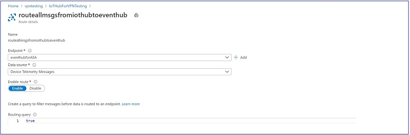
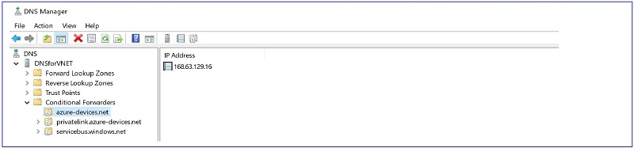

# Creating an End-to-End Azure IoT infrastructure in a Private Network

The default configuration of Azure services allows public IP access to those services. For example, an on-premises device with Internet access can connect to an Azure IoT Hub using a URL that resolves to a public IP address. While these Azure services can be locked down against unauthorized access and the communications between them is encrypted, some organizations require an additional level of network security. Specifically, they require preventing public IP access to any services, and mandate that all the services and communications to be on a private network. Though the process for how to do this is documented on a service-by-service basis for the various Azure services, the process for how to connect them all together is not entirely obvious.

 The goal of this document is to provide a sample of securing all the services and connections in a simple IoT scenario.

 Note: *This document does not include mouse-click-by-mouse-click instructions on how to deploy the various services. Rather it assumes a working knowledge of Azure, and includes only what components need to be configured, and examples of the configuration.*

## Contributors

- Spyros Sakellariadis, Program Manager, Industry Innovation, Enterprise Commercial Business
- David Apolinar, Cloud Solution Architect, US Financial Services Industry
- John Lian, Program Manager, Azure IoT Platform

## Major elements shown in end-to-end sample

This sample does not include all possible services or configurations, of course, it includes only a few services in order to demonstrate the basic structures and principles. The components that will be described include:

1. **Site-to-site VPN** - an IPsec tunnel between on-premises systems and Azure
2. **Azure IoT Hub** and **Event Hub** - disabling public IP access to these services
3. **Azure VM** - configuring a typical Azure asset with only private IP access
4. **DNS** - name resolution for assets with no public IP access

## High level architecture

The IoT sample described consists of some on-premises components as well as Azure services. To provde a visual reference for the items discussed, here are the high level architectures.

### On-premises configuration

The following diagram shows the elements in the sample's local environment.

As shown in the diagram above, a 3rd party gateway is installed on a computer which serves to pull telemetry from IoT devices and forwards the data to Azure IoT Hub. Guidance on how to set up one such gateway, [ICONICS IoTWorX](https://iconics.com/Products/IoTWorX), is available in the following locations and there is no need to replicate it here:

- [Using IoTWorX as a Gateway](https://iconics.com/Documents/WhitePapers/Using-IoTWorX-as-a-Gateway)
- [Installing IoTWorX on IoT Edge](https://iconics.com/Documents/Whitepapers/Installing-IoTWorX-on-IoT-Edge)

### Gateway output

The output from the gateway should be in a standard JSON format. In the sample shown, data from the gateway looks like this:

    {"gwy": "iotworx","name": "Output_Voltage","value": 0,"timestamp": "2020-10-20T13:48:55.247Z","status": true}
    {"gwy": "iotworx","name": "DC_Bus_Voltage","value": 320.5,"timestamp": "2020-10-20T13:48:55.247Z","status": true}
    {"gwy": "iotworx","name": "Capacitance_Temperature","value": 47.1,"timestamp": "2020-10-20T13:48:55.247Z","status": true}
    {"gwy": "iotworx","name": "Drive_Run_or_Halt","value": 2,"timestamp": "2020-10-20T13:48:55.248Z","status": true}

In addition, a hardware firewall is installed in the local environment, which serves as the local endpoint of the site-to-site VPN to Azure. Configuration of
the firewall depends upon the make and model of the firewall, of which there are many. Some sample configurations can be found here:

- [Azure VPN Gateways VPN device configuration samples](https://github.com/Azure/Azure-vpn-config-samples)

Finally, there is a DNS server in the local environment. Configuration of this server is described later in this document.

### Azure configuration

The following diagram shows the Azure architecture that processes data from the on-premises deployment shown above.

Each of these elements is described in the following sections.

## Setting up the site-to-site VPN

The following diagram shows the elements in the sample Azure environment needed to create an IPsec site-to-site Virtual Private Network.

A 'How-to Guide' for creating a site-to-site VPN is published on the Microsoft website here: [Create a Site-to-Site connection in the Azure portal](https://docs.microsoft.com/en-us/azure/vpn-gateway/vpn-gateway-howto-site-to-site-resource-manager-portal)

Configuration of these elements in the end-to-end sample is shown below.

### Virtual network in Azure

From the Azure portal, start the process of creating a virtual network by selecting **Create a Resource** > **Virtual network**. During setup, accept the proposed private IP address range, for example `10.2.0.0/16`. When deployment is complete, select the resource. The result should look similar to the following, with the exception of the DNS server, which will be added later:

### Virtual network gateway

From the Azure portal, select **Create a Resource** > **Virtual network gateway**. Select the Virtual Network just created, and accept the proposed public IP address. The result should look similar to this:

### Local network gateway

From the Azure portal, select **Create a Resource** > **Local network gateway**. This object represents the device on-premises that is the local endpoint for the IPsec tunnel. The IP address of the Local network gateway needs to be the public IP of that device, for example, the public IP address of the firewall or router on the WAN port provided by the ISP providing connectivity to the local site. (Here shown as `24.x.x.x`). The Address space needs to be the address space of the local network behind that firewall or router. Configuration in the end-to-end sample is as follows:

### Connection

From the Azure portal, select **Create a Resource** > **Connection**. The purpose is to create an object that represents the connection between the Virtual Network Gateway and the Local Network Gateway. Pick the local and Azure network gateways created above during setup of the connection. The IP addresses will be added automatically. Configuration in the end-to-end sample is as follows:

### Peering

Finally, in the end-to-end sample we created a second vnet in another Azure region, in order to emulate more complex environments where all of the assets are not in the same region. Having done this, all we need to do is create a vnet peering. From the vnet resource page, configure the peering between the two vnets in the Peerings section:

## Deploying an IoT Hub

The on-premises gateway will push telemetry data to the Azure IoT Hub, and all Azure services and applications will use that IoT Hub as the source of data from the on-premises devices. The following elements need to be created in Azure for the sample configuration:

A 'How-to Guide' for configuring IoT Hub in a vnet is published on the Microsoft website here: [IoT Hub support for virtual networks with Private Link and Managed Identity](https://docs.microsoft.com/en-us/azure/iot-hub/virtual-network-support)

Configuration of these elements in the end-to-end sample  is shown below. From the Azure portal, select **Create a Resource** > **IoT Hub**. When deployment is complete, select the resource. The Overview should be similar to the following:

### IoT Hub Overview

### Public access

In the How-to Guide referenced above it says the folloiwng:

The built-in Event Hub compatible endpoint doesn't support access over private endpoint. When configured, an IoT hub's private endpoint is for ingress connectivity only. Consuming data from built-in Event Hub compatible endpoint can only be done over the public internet.

IoT Hub's IP filter also doesn't control public access to the built-in endpoint. To completely block public network access to your IoT hub, you must

1. Configure private endpoint access for IoT Hub
2. Turn off public network access or use IP filter to block all IP
3. Stop using the built-in Event Hub endpoint by setting up routing to not send data to it
4. Turn off the fallback route
5. Configure egress to other Azure resources using trusted Microsoft service

The first step is to disable public IP access to the IoT Hub, which is done in in the Networking section:

### Private endpoints

Next, create private IP endpoints for this hub. Select the **Private endpoint connections** tab:

Click **+ Private endpoint** to create the private endpoint. The result should look similar to this:

## Event Hub

Next, set up another Azure resource, an Event Hub, and route all messages from the IoT Hub to it. Create an Event Hub. From the Azure portal, select **Create a Resource** > **Event Hub**. When deployment is complete, configuration should be similar to this:

### Event Hub Overview

The Overview tab of the Event Hub Namespace:

### Event Hub Networking

Disable public access by choosing **Allow access from selected networks**, selecting your virtual network, and checking the radio button to **Allow trusted Microsoft services to bypass this firewall**. Also add your client (e.g. laptop) IP address in the firewall section, or you will not be able to access the Event Hub to manage it.

### Event Hub Private Endpoints

Create a private endpoint for the Event Hub by clicking **+ Private endpoint**:

### Event Hub Shared Access Policies

Next, select **Shared access policies** and click **+ Add** to create a policy for the routing from IoT Hub. Make sure to select both **Listen** and **Send** rights:

### Event Hub Access Control

 As stated in the How-to Guide referenced above, to allow other services to find your IoT hub as a trusted Microsoft service, it must have a system-assigned managed identity: "To allow the routing functionality to access an event hubs resource while firewall restrictions are in place, your IoT Hub needs to have a managed identity." First, on the Event Hub:

Select **Access control (IAM)** and **Add**. Select **Add a role assignment** from the drop-down menu. In the Add role assignment pane, choose **Event Hubs Data Sender** for role, **Azure AD user, group, or service principal** for Assign access to, and  your IoT Hub's resource name (`IoTHubforVPNTesting`) in the next drop-down list.

## IoT Hub Message Routing

On your IoT Hub's resource page, navigate to the Identity tab. In the **Status** section, select **On**:

Under **Permissions**, click **Azure role assignments** and confirm that **Azure Events Hub Data Sender** had been added by the Event Hub configuration steps:

Finally, navigate to Message routing tab and forward all telemetry coming in to the IoT Hub to the Event Hub, using the IoT Hub Message routing feature:

Routing details in the sample are set so as to forward everything to the Event Hub by setting **Routing query** to **true**, with a consequence that no data can be retrieved from the IoT Hub itself by any application.

Test the routing by opening Visual Studio Code on your laptop. Install the [Azure Event Hub Explorer](https://marketplace.visualstudio.com/items?itemName=Summer.azure-event-hub-explorer). Right-click in a Terminal window, select **Select an Event Hub**, and pick your subscription, resource group, and finally Event Hub name. Then right-click in the Terminal window and select **Start Monitoring Event Hub Message** to see the data being received in the Event Hub:

This should be the same as the data coming out of the local gateway, shown in the [local gateway configuration](#gateway-output) section above.

## Azure virtual machine

The sample contains an Azure virtual machine simply as an example of setting up something in Azure that is accessible only through private addresses and as a way to show how to access other services that have only private addresses.

Guidance for creating an Azure virtual machine is published on the Microsoft website here: [Quickstart: Create a Windows virtual machine in the Azure portal](https://docs.microsoft.com/en-us/azure/virtual-machines/windows/quick-create-portal).

Configuration of the virtual machine in the end-to-end sample is shown below. From the Azure portal, select **Create a Resource** > **Windows Server 2019 Datacenter**. During setup enter selections so that it is deployed in the virtual network with only private IP access. (For the sample we named the virtual machine `ICONICSinVNET` because in a subsequent article we will deploy the [ICONICS GENESIS64](https://iconics.com/Products/GENESIS64) software in the virtual machine to analyze the IoT data and forward telemetry to an Azure Data Lake, but that is out of scope for the current sample.)  When deployment is complete, the configuration should be similar to the following:

Disable public IP address access and configure the network interfaces:

To verify that data arriving at the Event Hub is visible within the virtual machine, you can use Visual Studio code with the [Azure Event Hub Explorer](https://marketplace.visualstudio.com/items?itemName=Summer.azure-event-hub-explorer) installed. After launching Visual Studio code and selecting the Event Hub above, right click and select **Start Monitoring**. You should see the data that is arriving at the Event Hub from inside the VM:

This should be the same as the data coming out of the local gateway, shown in the [local gateway configuration](#gateway-output) section above.

## Deploying DNS servers

By default, Azure PaaS services are accessible over the internet and are routable using public IPs. When private link is enabled, Azure, by default, blocks access to these private link enabled services. For example, by default, [http://mydemovm.eastus.cloudapp.azure.com](http://mydemovm.eastus.cloudapp.azure.com) may resolve to `40.x.x.x`. But with private link, since we are preventing access to any public IP address and using only private endpoints, applications will need to resolve to the private endpoint IP address created within a VNET. For example, a private end-point will need to resolve to `10.2.0.x` instead of `40.x.x.x`.

Private DNS Zones make name resolution possible when private link is enabled. For example, if a storage account has private link enabled, a Private DNS zone is created with the A record pointing to that storage account. Once the Private Zone is linked to a VNET, any resource in that VNET can successfully resolve to the private IP address of the private link service using the local Azure 168.63.129.16 address.

However, when it comes to name resolution from on-premises, conditional forwarders are required since Private DNS Zones do not support conditional forwarders. As such, two DNS conditional forwarders are required. Locally, for on-premises devices to resolve requests to Azure services, and in Azure, to resolve on-premises resources. If hybrid name resolution were not required, then it is not necessary to create these forwarders in Azure. However, almost all use-cases require hybrid connectivity and name resolution.

### DNS Server in Azure VM

A virtual machine, `DNSforVNET`, is deployed in the sample in the same manner as `ICONICSinVNET`, in the virtual network and configured to have only private IP access:

In the sample, the DNS server got an IP address of `10.2.0.6`. In that virtual machine, the DNS Service is turned on and conditional forwarding records created for the Azure private domains used by the sample's assets. These conditional forwarders pass resolution requests to the standard Azure DNS service at `168.63.129.16`:

Next, the network configuration of the Azure VM created [above](#azure-virtual-machine) (`ICONICSinVNET`), and shown in the [Azure configuration diagram](#azure-configuration), is edited to use the new Azure DNS server (`DNSforVNET`) at `10.2.0.6`:

    IPv4 Address. . . . . . . . . . . : 10.2.0.5(Preferred)
    Subnet Mask . . . . . . . . . . . : 255.255.255.0
    Default Gateway . . . . . . . . . : 10.2.0.1
    DNS Servers . . . . . . . . . . . : 10.2.0.6

When we used Visual Studio Code in the application virtual machine to connect to the [Event Hub](#event-hub) `eventhubinvpn`, the DNS server running in `DNSforVNET` forwarded the request to resolve the name to the DNS service at `168.63.129.16`, which in turn resolved this as the address `10.2.0.8`, the private IP address of the Event Hub.

### DNS Server on-premises

In the on-premises network, the DNS service is configured on any computer, for example one at `192.168.1.8`. In the DNS running on `192.168.1.8` two conditional forwarding records are added for the Azure assets behind private IP addresses:

Next, the IP configuration of the gateway computer, shown in the [On-premises configuration diagram](#on-premises-configuration), is modified to use this new DNS server:

    IPv4 Address. . . . . . . . . . . : 192.168.1.122
    Subnet Mask . . . . . . . . . . . : 255.255.255.0
    Default Gateway . . . . . . . . . : 192.168.1.1
    DNS Servers . . . . . . . . . . . : 192.168.1.8

When the local gateway software connects to `HostName=IoTHubForVPNTesting.azure-devices.net;DeviceId=iotworx;SharedAccessKey=******`, the local DNS server forwards the request to resolve the name `IoTHubForVPNTesting.azure-devices.net` to `10.2.0.6`, the DNS server we created in Azure. In turn, that DNS server forwards the request to `168.63.129.16`, which in turn resolves this as `10.2.0,4`, the private IP address of the [IoT Hub](#deploying-an-iot-hub), (as shown in the [Azure configuration diagram](#azure-configuration)).
