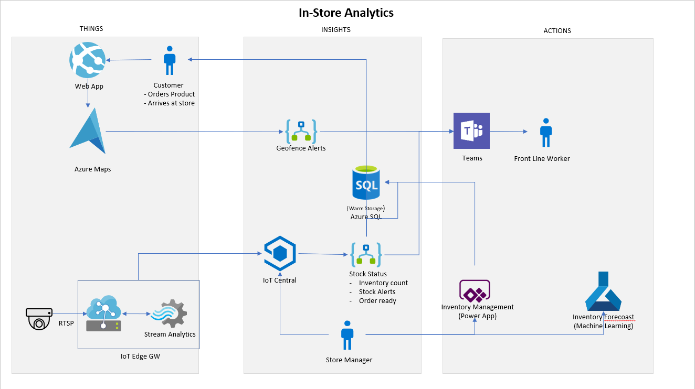

# Retail On The Edge

## Architecture

 <center>  </center>

## Requirements
- Demo targets Windows 64-bit Operating System.
- Visual Studio Code (required extensions are outlined in the VS Code environment setup section).
- Docker Community Edition.
- Git & Git LFS.
- Azure Subscription. You can set up a [trial account](https://azure.microsoft.com/en-us/free/search/) here.


## Clone the Retail on the Edge Demo Repository

Git will be used to copy all the files for the demo to your local computer.  

1. Install Git from [here](https://git-scm.com/download).
1. Install Git LFS from [here](https://help.github.com/en/github/managing-large-files/installing-git-large-file-storage)
    > IMPORTANT: Ensure you have Git LFS installed before cloning the repo or large files will be corrupt. If you find you have corrput files, you can run `git lfs pull` to download files in LFS.
1. Open a command prompt and navigate to a folder where the repo should be downloaded<br>
1. Issue the command `git clone https://github.com/Teodelas/RetailDemo.git`.

## Azure Resource Deployment

An Azure Resource Manager (ARM) template will be used to deploy all the required resources in the solution.  Click on the link below to start the deployment. Note that you may need to register Azure Resource Providers in order for the deployment to complete successfully.  If you get an error that a Resource Provider is not registered, you can register the Resource Provider by following the steps in this [link](https://docs.microsoft.com/en-us/azure/azure-resource-manager/management/resource-providers-and-types)

[](https://portal.azure.com/#create/Microsoft.Template/uri/https%3A%2F%2Fzarmada.blob.core.windows.net%2Farm-deployments-public%2Farm-template-rote.json "Deploy template")


### Deployment of resources

Follow the steps to deploy the required Azure resources.

Resources include:
- API Connections.
- App Service.
- App Insights.
- Azure Maps Account.
- Azure Maps Creator Resource.
- Container Registry.
- Key Vault.
- Logic Apps.
- Machine Learning Workspace
- SQL Server.
- SQL Database.
- Storage Account.
- Stream Analytics Job (Edge).

**BASICS**  

   - **Subscription**: Select the Subscription.
   - **Resource group**:  Click on 'Create new' and provide a unique name for the Resource Group.
   - **Location**: Select the Region to deploy the resources. All resources will be deployed to this region.
        > NOTE: This template has been confirmed to work within the **West US 2** region. If you wish to change the region, please ensure it supports the resources above.

**SETTINGS**

   - **Team Name**: Your desired Microsoft Teams name (Default is `Retail on the Edge`).
        > IMPORTANT: There are instructions later in the setup that outline how to create a new Team. Remember this name as it will need to match your newly created Team!
   - **Team Channel Name**: Your desired Microsoft Teams channel name (Default is `Front Line Workers`)
        > NOTE: This channel name specified above will be created by the Logic App if it does not exist.
   - **Customer Email**: Enter your email address. This will be used by the Logic App to notify the customer that their order is ready to be picked up.

> IMPORTANT: Remember the above values as you will not be able to retrieve them after submitting the template.

1. Read and accept the `TERMS AND CONDITIONS` by checking the box.
1. Click the `Purchase` button and wait for the deployment to finish.
1. Review the output values:
      - Go to your `Resource group` and click `Deployments` from the left navigation.
      - Click `Microsoft.Template`.
      - Click `Outputs` from the left navigation.
      - Save values for future use.

> IMPORTANT: You will need these values later in the setup.

> NOTE: Connection to the SQL server is allowed from all IP Addresses by default. To update this rule, follow the instructions in the `Optional Steps` section.

## Post Deployment Configuration

Some resources require some extra configuration.

### SQL Database schema

Here we will run the script for the creation of the tables required by the solution.

1. In the [Azure portal](https://portal.azure.com/) select the **Resource Group** you created earlier.
1. Select the **SQL database** resource.
1. Click the **Query editor** option in the left menu.
1. Enter the username `theadmin` and password `M1cro$oft2020` and click the `Connect` button.
1. Select **Open Query** from the top navigation and select `sql/script.sql` from the repo.
1. Click **Run**.
1. You should be able to see the created tables and stored procedures in the database.

### Edge Stream Analytics Job

Follow the next steps to setup the Edge Stream Analytics job.

1. In the [Azure portal](https://portal.azure.com/) select the **Resource Group** you created earlier.
1. Take note of the **Storage Account** resource name.
1. Select the **Stream Analytics Job** resource.
1. Click **Storage account settings** from the left navigation.
1. Click **Add storage account**.
1. Select the storage account created in the ARM setup and add a new container named `edgemodules`.
1. Click **Save** and confirm clicking the **Yes** button.
1. Select **Publish** from the left navigation.
1. Click **Publish** and confirm clicking the **Yes** button.
1. Wait for the operation to complete.
1. Save the **SAS URL** as you will need this later in the device deployment.

### Microsoft Teams: Team setup

This setup is required if the team is not created already and will be done using the **Microsoft Teams** app.

1. Open the **Microsoft Teams** app.
1. Log in into the app with the account that you will use to authenticate the Logic Apps.
1. Click the **Teams** option in the left menu.
1. Click the **Join or create a team** button at the bottom of the Teams list.
1. Click the **Create team** button.
1. Click the **Build a team from scratch**.
1. Click the **Private** option button.
1. Enter the name for the team, this should be same that you used during the ARM deployment for the **Team Name** setting.
    > NOTE: Default value is `Retail on the Edge`.
1. Click the **Create** button and wait for the creation to finish.
1. Click the **Skip** button.

#### Microsoft Teams: Connection authorization

Here we need to authorize the connection for the Teams API resource with the account that will be used to send the alert notification emails via the Logic Apps.

1. In the [Azure portal](https://portal.azure.com/) select the **Resource Group** you created earlier.
1. Select the **teams** API connection resource.
1. Click the **Edit API connection** option in the left menu.
1. Modify the default **Display Name** if desired.
1. Click the **Authorize** button to start the authorization process.
1. Follow the steps with the account you want to use.
1. When the process is finished, click the **Save** button.

#### Office365: Connection authorization

Here we need to authorize the connection for the Teams API resource with the account that will be used to send the alert notification emails via the Logic Apps.

1. In the [Azure portal](https://portal.azure.com/) select the **Resource Group** you created earlier.
1. Select the **office365** API connection resource.
1. Click the **Edit API connection** option in the left menu.
1. Modify the default **Display Name** if desired.
1. Click the **Authorize** button to start the authorization process.
1. Follow the steps with the account you want to use.
1. When the process is finished, click the **Save** button.

### Azure Maps account

Here we will setup an event subscription for the Azure Maps account in order to notify the geofence events to our Logic App.

1. In the [Azure portal](https://portal.azure.com/) select the **Resource Group** that you are using.
1. Select the **Azure Maps Account** resource.
1. Click the **Events** option in the left menu.
1. Click the **+ Event Subscription** button in the top of the panel.
1. Enter `logicappalerts` to the **Name** input field.
1. Leave `Event Grid Schema` as the **Event Schema**.
1. For the **System Topic Name** field enter the value `rotegeofencealert`.
1. Uncheck the **Geofence Result** and **Geofence Exited** options in the **Filter to Event Types** dropdown. Ensure that ONLY the **Geofence Entered** event is selected.
1. For the **Endpoint Type** select the **Web Hook** option.
1. Click the **Select an endpoint** link.
1. In the new panel update the **Subscriber Endpoint** field with the value from the deployment output named **Customer Arrived Alert Logic App Endpoint**.
1. Click the **Confirm Selection** button.
1. Click the **Create** button.

### Azure Maps Creator Setup

In this section we will use the IndoorMapSetup console app to use Creator to create an indoor map.

> NOTE: The portable executable provided is targeted for Windows 64-bit environments. If the .exe file below does not run on your PC, consider creating a VM and running the exe there.  The steps to create a VM are outside the scope of this document.

If you would like to do this manually, you can follow the tutorial here: [Create Indoor Map](https://docs.microsoft.com/en-us/azure/azure-maps/tutorial-creator-indoor-maps).

#### Run app
1. Open the folder `maps\IndoorMapSetupAppExecutable` in your repo.
1. Execute the **IndoorMapSetupApp.exe** file.
1. Paste the azure maps subscription key that you saved from the deployment with the name **Maps Account Key** and press enter.
    > NOTE: this process may take a few minutes.
1. The following output will be displayed.
    ```
    ***********************************************************
    *               Azure Maps Creator Setup                  *
    *                                                         *
    ***********************************************************
    Setup started...
    Enter the Azure Maps subscription key and press enter: {subscriptionKey}
    Upload Udid: {uploadUdid}
    Conversion Id: {conversionId}
    Dataset Id: {datasetId}
    Tileset Id: {tilesetId}
    Stateset Id: {statesetId}
    Press any key to exit
    ```
1. Copy and save the `Dataset Id`, `Tileset Id` and `Stateset Id` values for future use.
    > NOTE: These values are also saved to file.

> NOTE: The source code for the above application is available here: `maps/IndoorMapSetupApp`. You will need .NET Core 3.1 or later to run the application.

### Power App Setup

In this section we will setup the Inventory Power App.

#### Create the Connection to SQL

1. Login to [Power Apps](https://make.powerapps.com/).
1. Click the **Data** option in the left menu.
1. Click the **Connections** sub option from the list.
1. Click the **+ New connection** button.
1. Click the **SQL Server** option.
1. Select the **SQL Server Authentication** option for the **Authentication Type**.
1. Enter the following values from the outputs of the template deployment:
    * SQL Server Name: `<sql Server>` (Obtain value from deployment output or the Azure Portal).
    * SQL Database name: `<database Name>` (Default value is: `rote`).
    * Username: `<sql Server Username>` (Default value is: `theadmin`).
    * Password: `<sql Server Password>`(Default value is: `M1cro$oft2020`).
    * Choose a gateway: leave blank / not needed
1. Click the **Create** button and wait for the connection to be created.

#### Create the flow

1. Click the **Flows** option in the left menu.
1. Click the **+ New** option.
1. Select the **Create from template** option.
1. Select the **PowerApps button** option.
1. Click the **New step** button.
    >NOTE: There is an accompanying animation at the end of this section that outlines the  upcoming steps.
1. Search for the **SQL Server** option and find the **Execute store procedure (V2)** option.
1. Click `...` in the top right of the step and ensure the SQL connection is correct under **My Connections**.
1. Select the following options from the dropdown lists:
    * Server name: `Use connection settings (<sql Server>)`.
    * Database name: `Use connection settings (rote)`.
    * Procedure name: `[dbo].[CreateSupplierOrder]`.
1. For the following 4 input fields click the text box and select the **Ask in PowerApps** option under the **Dynamic content** tab.
    > IMPORTANT! You must do this in the order below or it will fail. If the **Ask in PowerApps** option is not displayed, click **See more**.
    1. CreationDateStr.
    1. ProductCode.
    1. Quantity.
    1. Total.

1. Add a new step and search for the `HTTP` type and select it.
1. Configure the steps with the following detail:
    * Method: `POST`.
    * URI: This is the URI from the output of the deploy with the name: **Order Ready to Picked Up Logic App Endpoint**.
    * Body: Enter the following in the body input field:
        `{
            "name": ""
        }`
    * Click in the double-quotes ("") and select Executestoredprocedure(V2)_ProductCode
1. Click the **Save** button.

    > NOTE: The animation below outlines the above process.
    <center>  </center>

#### Create the App

1. Click the **Apps** option in the menu.
1. Click the **Import canvas app** button on the top.
1. Click the **Upload** button and select `powerapp/Inventory.zip`.
1. Click the **Configure** button next to the **App** resource.
1. Select **Create as new** under **Setup** and click the **Save** button.
1. Click the **Configure** button next to the **SQL Server Connection** resource.
1. Select the connection created earlier and click the **Save** button.
1. Select the **Configure** button next to the **Flow** resource.
1. Select the flow created earlier and click the **Save** button.
1. Click the **Import** button and wait for the app to be imported.
1. Click the **Apps** option in the menu.
1. Open the Inventory App and allow the use of the SQL Server connection.

## Deployment Manifest Setup

### Setup Visual Studio Code Development Environment

1. Install [Visual Studio Code](https://code.visualstudio.com/Download) (VS Code) if required.
1. Install 64 bit [Anaconda with Python version 3.7](https://www.anaconda.com/distribution).
1. Install [Docker Community Edition (CE)](https://docs.docker.com/install/#supported-platforms) if required. Don't sign in to Docker Desktop after Docker CE is installed.
1. Install the following extensions for VS Code:
    * [Azure Machine Learning](https://marketplace.visualstudio.com/items?itemName=ms-toolsai.vscode-ai) ([Azure Account](https://marketplace.visualstudio.com/items?itemName=ms-vscode.azure-account) and the [Microsoft Python](https://marketplace.visualstudio.com/items?itemName=ms-python.python) will be automatically installed)
    * [Azure IoT Hub Toolkit](https://marketplace.visualstudio.com/items?itemName=vsciot-vscode.azure-iot-toolkit)
    * [Azure IoT Edge](https://marketplace.visualstudio.com/items?itemName=vsciot-vscode.azure-iot-edge)
    * [Docker Extension](https://marketplace.visualstudio.com/items?itemName=ms-azuretools.vscode-docker)
1. Restart VS Code.
1. Select **[View > Command Palette…]** to open the command palette box, then enter **[Python: Select Interpreter]** command in the command palette box to select your Python interpreter.
1. Select the Anaconda interpreter.
1. Enter **[Azure: Sign In]** command in the command palette box to sign in Azure account and select your subscription.

### Container Registry Setup

1. Launch Visual Studio Code, and open the `/device` folder in your registry.
1. Update the .env file with the values for your container registry.
    - In the [Azure portal](https://portal.azure.com/) select the **Resource Group** you created earlier.
    - Select the **Container Registry** resource.
    - Select **Access Keys** from the left navigation.
    - Update the following in `device/.env` with the following values from the **Access Keys** within the Container Registry:

        CONTAINER_REGISTRY_ADDRESS=`<Login Server>` (Ensure this is the login server and NOT the Registry Name)

        CONTAINER_REGISTRY_USER_NAME=`<Username>`

        CONTAINER_REGISTRY_PASSWORD=`<Password>`

        ASA_BLOB_URL=`<ASA Blob Url>` (the one you obtained earlier in the `Edge Stream Analytics Job` setup step)

    - Save the file.
1. Sign in to your Azure Container Registry by entering the following command in the **Visual Studio Code integrated terminal** (replace <CONTAINER_REGISTRY_ADDRESS>, <CONTAINER_REGISTRY_USERNAME>, and <CONTAINER_REGISTRY_PASSWORD> with your container registry values set in the .env file).

    `docker login -u <CONTAINER_REGISTRY_USER_NAME> -p <CONTAINER_REGISTRY_PASSWORD> <CONTAINER_REGISTRY_ADDRESS>`

### **OPTIONAL**: Use an RTSP stream

As default, the app uses videos to imitate an empty or stocked shelf when consuming the model. If you want to use an RTSP stream instead, you can do the following:

1. Open `device/deployment.test-amd64.template.json`.
1. Update the following **desired properties** for the **CameraCapture** module.
    ```json
    "VideoPath": "<RTSP Stream Address>"
    ```
1. Save the file.
    > NOTE: The model on the device works with unlabelled silver cans. 4 or more cans is a stocked shelf, any less will trigger an alert.

     

### **OPTIONAL**: Add your own model

The **ImageClassifierService** module comes with a Custom Vision object detection model that has been trained to recognised cans with the tag "GroceryItem".

If you would like to use a different product, you can update the model, however, you must tag the item with "GroceryItem" or the Edge Streaming Analytics Job will not work correctly.

1. Replace `device/modules/ImageClassifierService/app/model.pb` with your new model
1. Increment the version in the `device/modules/ImageClassifierService/module.json` file.
1. Complete the steps in the next section.

### Deploy solution to the Container Registry

1. Right click on `device/deployment.test-amd64.template.json`.
1. Select **Build and Push IoT Edge Solution**.
1. Wait for the process to complete.
1. Go to `device/config` and save `deployment.test-amd64.json` as you will need this for the IoT Central setup later in the guide.

## IoT Central Setup

Creating a new IoT Central environment is outside the scope of this document.  Follow the instructions [here](https://docs.microsoft.com/en-us/azure/iot-central/retail/tutorial-in-store-analytics-create-app) to setup an IoT Central Retail application.

Once your environment is created, complete the following steps to configure it for the demo.

### Customize the Theme
Click [here](https://docs.microsoft.com/en-us/azure/iot-central/retail/tutorial-in-store-analytics-customize-dashboard) and [here](https://docs.microsoft.com/en-us/azure/iot-central/core/howto-customize-ui) to learn about how to customize IoT Central

1. Change the image on the dashboard to use the Contoso Market logo [here](https://github.com/Teodelas/RetailDemo/blob/master/images/ContosoMarketLogo.png)
1. Set the Browser colors to #ff566C

### Create Device Template

1. [Sign in](https://apps.azureiotcentral.com/myapps) to your IoT Central environment.
1. Click **Device Templates**
1. Click **+ New**.
1. Click **Azure IoT Edge**.
1. Click **Next: Customize**.
1. **Device template name**: This can be anything but you'll need to remember it for use later.
1. Click **Browse**.
1. Upload the `device/config/deployment.test-amd64.json` file.
1. Click **Next: Review**.
1. Click **Create**.

### Customize Device Template

1. Click on **Module ImageClassifierService**.
1. Click **Delete** (and then **Delete** again).
    > NOTE: this module doesn't have any properties or telemetry so is considered invalid during publishing.
1. Under **Module GroceryItemsEdgeStreamJob**, click **Manage**.
1. Using **+ Add capability**, add the following items. Each is of capability type **Telemetry**:
    * Name: `message_type`, schema: `String`
    * Name: `event_type`, schema: `String`
    * Name: `timestamp`, schema: `DateTime`
    * Name: `count`, schema: `Double`
    > NOTE: all other values can be left as their default.
1. Click **Save**.
1. Click **Views**.
1. Click **Visualizing the device**.
1. Check **count**.
1. Click **Add tile**.
1. Click **Save**.
1. Click **Publish** (and then **Publish** again).

### Rules

1. Click **Rules**.
1. Click **+ New**.
1. Enter a **Rule Name**
1. Select your new **Device Template** from the drop down.
1. Add the following conditions:
    * `message_type` Equals `alert`
    * `event_type` Does not equal `update`
    * `count` Is greater than or equal to `0`
1. Under **Action**, click **+ Webhook**.
1. Enter `Logic App` for the **Display name**.
1. Insert the **Stock Level Alert Logic App Endpoint** from the outputs of the ARM template.
1. Click **Done**.
1. Click **Save**.

### Devices

1. Click **Devices**.
1. Click **+ New**.
1. Choose the template created earlier from **Template type**.
1. Optionally customize the device **ID** or **name**.
1. Click **Create**.
1. Click on your new **Device ID** (in the device list).
1. Click **Connect**.
1. **Copy** the following values:
    * ID scope
    * Device ID
    * Primary key
    > NOTE: these will be used to connect the device shortly using DPS.

### API Token

1. Click **Administration**.
1. Click **API Tokens**.
1. Click **+ Generate Token**.
1. Enter a **Token name**.
1. Leave **Role** as **Administrator**.
1. Save the token for later use in the Web App Setup.

### Add Inventory Monitoring to Dashboard

1. At the home page of IoT Central App, click on **Edit**
1. Under the section **Add a tile**:
 * For **Device group** chose the IoT Edge device group created earlier
 * For **Devices** choose the device that has been onboarded
 * For **Telemetry** check out count
 1. Click on **Add tile**
 1. Move the tile so it's prominently displayed
 1. Click **Save**


## Device Setup

### Azure VM

The easiest option to create a device is to use the IoT Edge template available in Azure.

1. **Provision** a new VM using the [template](https://portal.azure.com/#create/microsoft_iot_edge.iot_edge_vm_ubuntuubuntu_1604_edgeruntimeonly). Consider the following when provisioning:
    * You can use the existing resource group you have created or create a new one.
    * Ensure port 22 is open (this is the default).
    * Select a machine type with at least two vCPU cores.
    * If you haven't used SSH before/recently, password-based auth might be an easier option.
1. Once provisioning is complete, open your preferred shell.
    > NOTE: ensure you have SSH installed. If you're not sure, you can always use the [Cloud Shell](https://shell.azure.com).
1. Run `ssh <your-username>@<your-machine-ip-address>`.
    > NOTE: your username will be the one you specified during provisioning and your machine IP address will be available from the Azure Portal (by viewing the VM you just created).
1. Once connected to the machine, run `sudo nano /etc/iotedge/config.yaml`.
1. Comment out the following section (i.e. add `#` before each line):
    ```yaml
    provisioning:
        source: "manual"
        device_connection_string: "<ADD DEVICE CONNECTION STRING HERE>"
    ```
1. Uncomment out the following section (i.e. remove `#` before each line - and the space):
    >NOTE: This is the bottom DPS code block.
    ```yaml
    provisioning:
        source: "dps"
        global_endpoint: "https://global.azure-devices-provisioning.net"
        scope_id: "{scope_id}"
        attestation:
          method: "symmetric_key"
          registration_id: "{registration_id}"
          symmetric_key: "{symmetric_key}"
    ```
1. Update `{scope_id}`, `{registration_id}`, and `{symmetric_key}` with the values you copied from the previous section.
    > NOTE: `scope_id` refers to ID scope, `registration_id` refers to the device ID, and the `symmetric_key` refers to the primary key.

    > IMPORTANT: Make sure to remove the `{}` in the placeholders.

1. Press `CTRL + X`, `Y`, and the `Enter` to save and quit.
1. Run `sudo systemctl restart iotedge`.
    > NOTE: Your `config.yaml` file should look like the below: 
    <center>  </center>
1. Run `sudo iotedge list` to see if your modules are running (these may take a while to download). You can also run `sudo iotedge check` to see if there are any issues with your configuration. 

Learn more [here](https://docs.microsoft.com/en-us/azure/iot-edge/how-to-install-iot-edge-linux#configure-the-security-daemon).

### Physical devices

If you would like to onboard an actual device, you can follow instructions here:

 - [Linux](https://docs.microsoft.com/en-us/azure/iot-edge/how-to-install-iot-edge-linux)
 - [Windows](https://docs.microsoft.com/en-us/azure/iot-edge/how-to-install-iot-edge-windows)
 - [Linux containers on Windows](https://docs.microsoft.com/en-us/azure/iot-edge/how-to-install-iot-edge-windows-with-linux)  

### Web App Settings

Next we wil update our web app configuration settings.

1. In the [Azure portal](https://portal.azure.com/) select the **Resource Group** you created earlier.
1. Select the **App Service** resource.
1. Click the **Configuration** option in the left menu.
1. Update the following settings by clicking Edit then Save:
    * Name: `Azure:Maps:DatasetId`, Value: `<DatasetId from Maps Output>`
    * Name: `Azure:Maps:StateSetId`, Value: `<StateSetId from Maps Output>`
    * Name: `Azure:Maps:TilesetId`, Value: `<TileSetId from Maps Output>`
    * Name: `Azure:IoTCentral:DeviceId`, Value: `<IoT Central Device Id>`
    * Name: `Azure:IoTCentral:IoTCentralDomain`, Value: `<IoT Central Domain>` (e.g. `<instance>.azureiotcentral.com`)
    * Name: `Azure:IoTCentral:IoTCentralApiToken`, Value: `<IoT Central API token>`
1. Click **Save** to commit the changes.

## Notebook Setup

In this section, we will setup our notebook with the required files for the generation of the model.

### Upload training data file:

1. In the [Azure portal](https://portal.azure.com/) select the **Resource Group** you created earlier.
1. Select the **Storage account** resource.
1. Click the **Containers** option in the left menu under **Blob service**.
1. Click the **azureml-blobstore-GUID** container.
1. Click the **Upload** button in the top.
1. Click the **Select a file** input and select the `ml\data\ntest_data.parquet` from your repo.
1. Click the **Upload** button and wait for the upload to finish.
1. Click the **Upload** button in the top again.
1. Click the **Select a file** input and select the `ml\data\train_data.parquet` from your repo.
1. Click the **Upload** button and wait for the upload to finish.

### Notebook files upload

1. Select **Azure Active Directory** option from the main navigation in the Azure Portal:

   
1. Copy the **Tenant Id** value from the overview as you will need this value later.
1. Go back to the **Resource Group** you created earlier.
1. Select the **Machine Learning** resource.
1. Take note of the following values to be used later in the deployment
   * Resource Group
   * Workspace Name
   * Subscription ID
   
1. Click the **Launch now** button to open the **Machine Learning workspace**.
1. Click the **Notebooks** option in the left menu under **Author**.
1. Click the **Upload files** button.
1. Select the file `rote-forecast.ipynb` inside the `ml` folder.
1. If prompted, check the **I trust contents of this file ***.
1. Select your username folder from the target directory list.
1. Click the **Upload** button.

### Notebook configuration

We need configure values within the notebook before being able to execute it:

1. Click the `rote-forecast.ipynb` in the **My files** navigation:
1. Click the **New Compute** button.
1. Enter the name `compute-{your-initials}`.
1. Select **CPU (Central Processing Unit)** from the **Virtual machine type** dropdown.
1. Select the virtual machine size **Standard_D12_v2**.
1. Click the **Create** button and wait for the compute to be created.
   > **Note**: This process can take several minutes; wait until status of **compute** is `Running`.
1. Click the **Edit** dropdown and select the **Edit in Jupyter** option.
   > **Note**: If required, login with your Azure credentials.    
1. Replace the values within the **Setup Azure ML** cell with the values you obtained in the **Notebook files upload** section:
   ```
   interactive_auth = InteractiveLoginAuthentication(tenant_id="<tenant_id>")
   # Get instance of the Workspace and write it to config file
   ws = Workspace(
       subscription_id = '<subscription_id>',
       resource_group = '<resource_group>',
       workspace_name = '<workspace_name>',
       auth = interactive_auth)
   ```
1. Click **File** > **Save and Checkpoint** from the menu.
1. Close the browser tab being used to edit the Jupyter notebook
1. In the tab with the **Machine Learning Workspace**:
1. Start to execute the cells with following considerations:
   * After creating the **utils.py** file, you MUST restart the kernel.
   * For the **Setup Azure ML** cell observe the output to **authenticate** via the URL provided (https://microsoft.com/devicelogin).
   * From here, **Run** the remaining cells sequentially until you have executed the notebook.
   * Executing the **Monitor Experiment** takes on average around **17 minutes**.
>**IMPORTANT**: Remember to wait for each cell to execute before continuing.

## In-Store Analytics Demo Usage
The steps below cover how to demonstrate the functionality of the demo. To perform the demonstration in a business context, we've created a walkthrough with Retail personas.  Once you're familiar with the demo architecture and steps, consider using the retail version of the demo walkthrough located [here](https://github.com/Teodelas/RetailDemo/blob/master/Retail%20Demo%20Script.docx)

### AI on the Edge
These steps show how AI + IoT on the Edge can help monitor inventory
1. Open the **Contoso Market Web Application.**
1. Click on **Canned Beans**.
1. Click **Buy**.
1. Click **Cart** on the navigation. Increasing quantity purchased is not needed.
1. Click on **Proceed to Checkout**.
1. Click **Proceed to Pay**
At this point in the demo, we can show that customer demand is diminishing stock.  We can use AI on the Edge to react faster:

1. Triggering the **Low Stock Alert**:
    * Default Behavior: An IoT Edge module property update occurs after the customer makes the order to set the video on the module to show Low Stock.
    * RTSP Stream: You should make sure there are less than 4 cans in the cameras vision to trigger the alert.
1. Go to **Microsoft Teams** and observe the **Low Stock Alert** from the device in the **Front Line Workers** channel.
1. OPTIONAL: If you want to restock the shelves you can do the following (note this will also happen when you reset the demo):
    * RTSP Stream: Add more than four cans in the cameras vision and observe the restocked alert in Teams.
    * Videos:
        * Go to your IoT Central environment.
        * Click **Devices**.
        * Click on your device.
        * Click **Manage** from the tabs.
        * Udpate the **CameraCapture** property **VideoPath** to `./StockedShelf.mp4`.
        * Observe the restocked alert in Teams.
1. OPTIONAL: Go to **IoT Central** and show that the tile added for the IoT Edge device is reporting the sock level

### Power Platform
These steps show how the integration capabilities of the Power Platform
1. Go to [Power Apps](https://make.powerapps.com).
1. Click **Apps**.
1. Open the **Inventory** application.
1. At the end of the **Canned Beans** row, click to make an order.
1. Select the **Quantity**. This is optional and does not impact the demo
1. Click **Make Order**.
1. Observe the new order.
1. **Triggering the Customer Email notification**. This is a hidden trigger to make the demo simpler to execute and happens when you make the supplier order. Customer (you) should received an email notification saying that your product is ready to be picked up!

### Geospatial Analytics
These steps show the integration with Azure maps
1. Go back to the **Contoso Market Web Application.**
1. Click **Account** in the navigation. This is a hidden trigger that will trigger a geofence alert that will create a notification via a Logic App.
1. Go to **Microsoft Teams** and observe the **Customer Has Arrived Alert** in the **Front Line Workers** channel.
1. Click the Notification to get directions to the store.
1. Click the **Floor Map** to gain focus. (May need two clicks)/ You will see floor levels in the top right.
1. You will see Contoso Markets at store 252 is highlighted.

### Inventory Forecasting
1. Run the notebook you created in the previous section and follow the necessary steps. You may want to explain what each step is performing when demoing the notebook.


#### Resetting the demo

To reset the demo, manually navigate to `http://<webapp-url>/reset`. This will do the following updates:
1. Reset the database into its original state.
1. If you are using the video, it will put it back to the stocked shelf state.
1. Reset the users Geofence location.

It is recommended to refresh the web application after this step before running through the demo again.


## Optional Steps

In this section we will describe some steps that are not required for the demo but allow for further customization if required.

### SQL Server IP rule update

Follow the next steps to update or remove the rule that allow the connection from all IP addresses.

1. In the [Azure portal](https://portal.azure.com/) select the **Resource Group** that you are using.
1. Find the **SQL server** resource and click it to see the detail.
1. Click the **Firewalls and virtual networks** option in the menu on the left under the **Security** section.
1. Check the **AllowAllIps** rule.
1. If you want to remove click the **...** button next to the rule and click the **Delete** button.
1. If you want to update the rule, click and update the values of the **Start IP** and **End IP** columns of the rule with the values you want.
  > Note: For a single IP set both values with the required IP.
1. Click the **Save** button.
